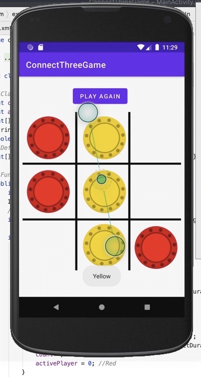
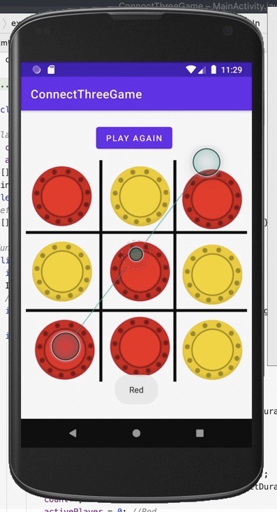

# Connect3Game
### Things I learnt while making the android app :
- About GridLayouts
- About ImageViews and their properties
- About animations and translations
- About event listeners 
- To clear images 

## Features of the games
- One can reset the game at any point of the time by clicking on play again
- Animations on the coin
- One wins if three coins of the same color appear either in the same row/column or diagonally
- If no one wins the toast message for Draw appears
- One can't click on the same grid where the coin is already present it gives an error message via the help of the toast
- One cant't continue to place coins after a player wins

## Glimpse of the game

